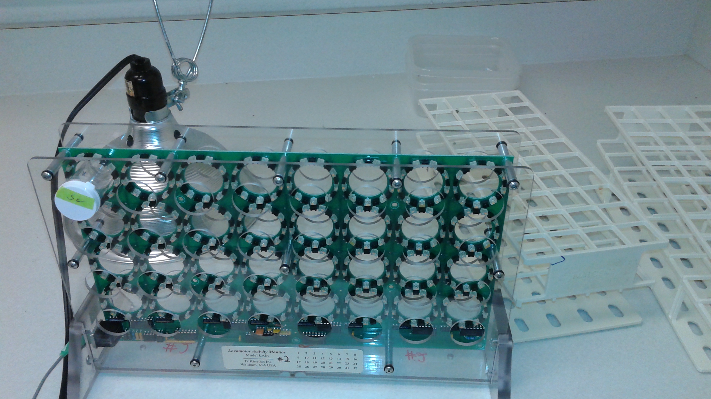
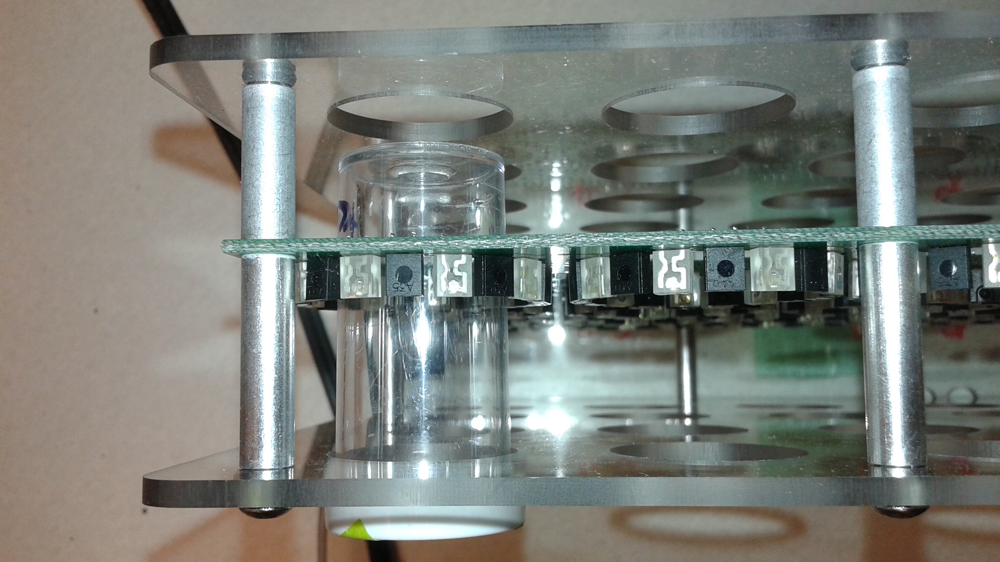

```{r setup, warning=FALSE, echo=FALSE, include=FALSE}
#Source files: From working directory == scripts

source('Packages_source_file.R')
source('Activity_cleanAllData.R')
#source('ActivityDrosophila_ComplexCues_EXP2.R')
#source('ActivityDrosophila_ComplexCues_EXP3.R')
#source('ActivityDrosophila_MantidCues_Naive.R')
#source('ActivityDrosophila_SpiderCues_Nieve.R')
#source('PredationActivityAnalysisJune2015.R')
```


```{r, include=FALSE, echo=FALSE, warning=FALSE}
source("Activity_allData_plotsModels.R")
```








### Evolved Populations:
Plot:
```{r, echo=FALSE, warning=FALSE}
print(LT_plot2)
```

```{r, include=FALSE, echo=FALSE, warning=FALSE}
#head(dat.hourly_2)

#Need day effect: start day == many different days
```

Model:

```{r, eval=FALSE}
hour.mod <- lm(Hourly_activity ~ Predation + Predation:Population + hour + monitor + start_day,data=dat.hourly_2)


summary(hour.mod)

```

```{r, eval=FALSE}
# Accounting for the auto-correlation
gls.mod <- gls(Hourly_activity ~ Predation + Predation:Population + hour + monitor + start_day,
    correlation = corAR1(form =~hour|individual),
    data=dat.hourly_2)


anova(gls.mod)

summary(gls.mod)
```


```{r}
gls.mod.2 <- gls(Hourly_activity ~ Predation + Predation:Population + light + light:Predation +  hour + monitor + start_day,
    correlation = corAR1(form =~hour|individual),
    data=dat.hourly_2)  

summary(gls.mod.2)
```


What are we trying to achieve? We want to fit a model that looks something like this

``` 
new.model <- glmer(Hourly_activity ~ Predation + Predation:Population + light + light:Predation +  **f(hour)** + monitor + start_day 
    + (1 + **f(hour)** + light | individual),
    correlation = corAR1(form =~hour|individual)) 
    # Do we still need this for residual variance?).
```    

The question is, what is the functional form of *f()`?


Data Lunch Notes:


### Mantid Cues
```{r, echo=FALSE, warning=FALSE}
print(Man_plot2)
```

```{r, eval=FALSE}
man.mod <- lm(activity_counts ~ Treatment + hour + monitor,data=Mantid_hour)


summary(man.mod)
#pacf(resid(man.mod))
```


```{r, eval=FALSE}
man_mod_2 <- gls(activity_counts ~ Treatment + hour + monitor, correlation = corAR1(form = ~ 1|hour), data=Mantid_hour)

anova(man_mod_2)
summary(man_mod_2)
#acf(resid(man_mod_2))
```


```{r}
man_mod_3 <- gls(activity_counts ~ Treatment + light + light:Treatment +  hour + monitor, correlation = corAR1(form =~1|hour), control = list(singular.ok = TRUE), data=Mantid_hour)


summary(man_mod_3)
#confint(man_mod_3)
#acf(resid(man_mod_3))
```


### Spider Cues
Plot:
```{r, echo=FALSE, warning=FALSE}
print(spi_plot2)
```

Model:

```{r, eval=FALSE}
hour.mod <- lm(activity_counts ~ Treatment + hour + monitor,data=act_hour)


summary(hour.mod)
#pacf(resid(hour.mod))
```


```{r, eval=FALSE}
correl_mod <- gls(activity_counts ~ Treatment + hour + monitor, correlation = corAR1(form = ~ 1|hour), data=act_hour)

anova(correl_mod)
summary(correl_mod)
#acf(resid(correl_mod))
```


```{r}
act_cor_light_mod <- gls(activity_counts ~ Treatment + light + light:Treatment +  hour + monitor, correlation = corAR1(form =~1|hour), control = list(singular.ok = TRUE), data=act_hour)


summary(act_cor_light_mod)
#confint(act_cor_light_mod)
#acf(resid(act_cor_light_mod))
```


### Complex Cues: Experiment 2 (Crickets vs. Spiders)
```{r, echo=FALSE, warning=FALSE}
print(Exp2_plot2)

```


```{r, eval=FALSE}
Exp2_mod <- lm(activity_counts ~ Treatment + hour + monitor,data=Exp2_hour)


summary(Exp2_mod)
#pacf(resid(Exp2_mod))
```


```{r, eval=FALSE}
Exp2_mod_2 <- gls(activity_counts ~ Treatment + hour + monitor, correlation = corAR1(form = ~ 1|hour), data=Exp2_hour)

anova(Exp2_mod_2)
summary(Exp2_mod_2)
#acf(resid(Exp2_mod_2))
```


```{r}
Exp2_mod_3 <- gls(activity_counts ~ Treatment + light + light:Treatment +  hour + monitor, correlation = corAR1(form =~1|hour), control = list(singular.ok = TRUE), data=Exp2_hour)


summary(Exp2_mod_3)
#confint(Exp2_mod_3)
#acf(resid(Exp2_mod_3))
```


### Complex Cues: Experiment 3: Crickets, Flies, Spiders fed crickets and spiders fed flies

```{r, echo=FALSE, warning=FALSE}
print(Exp3_plot2)
```

```{r, eval=FALSE}
exp3.mod <- lm(activity_counts ~ Treatment + hour + monitor,data=Exp3_hour)


summary(exp3.mod)
#pacf(resid(exp3.mod))
```


```{r, eval=FALSE}
exp3.mod_2 <- gls(activity_counts ~ Treatment + hour + monitor, correlation = corAR1(form = ~ 1|hour), data=Exp3_hour)

anova(exp3.mod_2)
summary(exp3.mod_2)
#acf(resid(exp3.mod_2))
```


```{r}
exp3.mod_3 <- gls(activity_counts ~ Treatment + light + light:Treatment +  hour + monitor, correlation = corAR1(form =~1|hour), control = list(singular.ok = TRUE), data=Exp3_hour)


summary(exp3.mod_3)
#confint(exp3.mod_3)
#acf(resid(exp3.mod_3))
```

